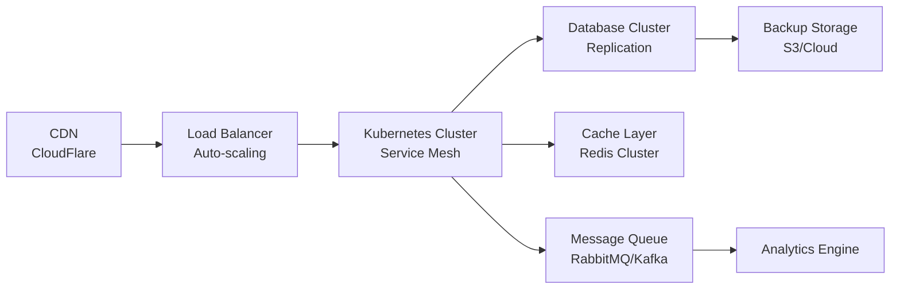

# Royal Reels Casino - Architecture Overview

## System Architecture

```mermaid
graph TB
    subgraph Client["Client Layer"]
        WEB["Web Browser<br/>React/Next.js"]
        MOBILE["Mobile App<br/>iOS/Android"]
        ADMIN["Admin Dashboard<br/>Management UI"]
    end

    subgraph API["API Gateway & Services"]
        GATEWAY["API Gateway<br/>Load Balancer"]
        AUTH["Authentication Service<br/>JWT/OAuth"]
        GAME["Game Engine Service<br/>RNG & Logic"]
        WALLET["Wallet Service<br/>Balance Management"]
        PAYMENT["Payment Service<br/>Transaction Handler"]
        USER["User Service<br/>Profile & KYC"]
    end

    subgraph Data["Data Layer"]
        USERDB["User Database<br/>PostgreSQL"]
        GAMEDB["Game Database<br/>Redis Cache"]
        WALLETDB["Wallet Database<br/>PostgreSQL"]
        AUDITDB["Audit Log Database<br/>PostgreSQL"]
    end

    subgraph External["External Integrations"]
        PAYMENT_GATEWAY["Payment Gateways<br/>Stripe/Square"]
        CRYPTO["Crypto Processors<br/>Blockchain"]
        KYC_SERVICE["KYC/AML Service<br/>Third-party"]
        ANALYTICS["Analytics Service<br/>Data Warehouse"]
    end

    subgraph Security["Security & Compliance"]
        ENCRYPTION["Encryption Layer<br/>TLS 1.3"]
        FRAUD["Fraud Detection<br/>ML Models"]
        COMPLIANCE["Compliance Engine<br/>Regulations"]
        BACKUP["Backup & Recovery<br/>Multi-region"]
    end

    subgraph Gaming["Gaming Infrastructure"]
        RNG["Random Number Generator<br/>Certified"]
        JACKPOT["Jackpot Management<br/>Pool Distribution"]
        MULTIPLAYER["Multiplayer Service<br/>WebSocket"]
        REWARDS["Rewards Engine<br/>Points/Bonuses"]
    end

    %% Client connections
    WEB --> GATEWAY
    MOBILE --> GATEWAY
    ADMIN --> GATEWAY

    %% API Gateway routing
    GATEWAY --> AUTH
    GATEWAY --> GAME
    GATEWAY --> WALLET
    GATEWAY --> PAYMENT
    GATEWAY --> USER

    %% Service to Database
    AUTH --> USERDB
    USER --> USERDB
    GAME --> GAMEDB
    WALLET --> WALLETDB
    PAYMENT --> WALLETDB
    AUTH --> AUDITDB
    PAYMENT --> AUDITDB

    %% External integrations
    PAYMENT --> PAYMENT_GATEWAY
    PAYMENT --> CRYPTO
    USER --> KYC_SERVICE
    GAME --> ANALYTICS

    %% Gaming infrastructure
    GAME --> RNG
    GAME --> JACKPOT
    GAME --> MULTIPLAYER
    WALLET --> REWARDS

    %% Security layer
    GATEWAY -.->|secures| ENCRYPTION
    PAYMENT -.->|checks| FRAUD
    USER -.->|enforces| COMPLIANCE
    USERDB -.->|protected by| BACKUP
```



## Component Details

### Client Layer
- **Web Application**: React/Next.js single-page application
  - Responsive design for desktop/tablet
  - Real-time game state updates
  - Progressive Web App (PWA) support
  
- **Mobile Application**: Native iOS/Android apps
  - Push notifications for promotions
  - Biometric authentication
  - Offline game library preview
  
- **Admin Dashboard**: Management interface
  - Real-time player monitoring
  - Revenue analytics & reporting
  - Withdrawal approval workflow
  - VIP player management

### API Gateway & Services

#### Authentication Service
- JWT token generation & validation
- Multi-factor authentication (MFA)
- Session management
- OAuth 2.0 integration for social login

#### Game Engine Service
- Game logic execution
- RNG (Random Number Generator) integration
- Bet placement & result calculation
- Game state persistence
- Return to Player (RTP) compliance monitoring

#### Wallet Service
- Balance management
- Transaction history
- Deposit/withdrawal processing
- Multi-currency support
- Real-time balance synchronization

#### Payment Service
- Payment gateway integration
- Transaction routing
- Fraud detection
- Reconciliation & reporting
- PCI DSS compliance

#### User Service
- Player profile management
- KYC/AML verification
- Preference management
- Communication history

### Data Layer

- **User Database (PostgreSQL)**
  - Player accounts & credentials
  - Profile information
  - Device/location tracking
  - Account status & restrictions

- **Game Database (Redis)**
  - Active game sessions
  - Game state caching
  - Leaderboards
  - Real-time game data

- **Wallet Database (PostgreSQL)**
  - Transaction ledger
  - Balance records
  - Withdrawal queue
  - Payment method storage

- **Audit Log Database (PostgreSQL)**
  - Compliance logging
  - Security event tracking
  - Login history
  - Transaction audit trail

### Gaming Infrastructure

#### Random Number Generator (RNG)
- Certified & audited for fairness
- Quantum-based or cryptographically secure
- Regular testing & validation
- Compliance documentation

#### Jackpot Management
- Progressive jackpot pool
- Payout algorithms
- Multi-game contribution
- Real-time pool tracking

#### Multiplayer Service
- WebSocket for real-time communication
- Player matchmaking
- Chat & social features
- Tournament management

#### Rewards Engine
- Loyalty points calculation
- VIP tier management
- Bonus allocation
- Promotion tracking

### External Integrations

- **Payment Gateways**: Stripe, Square, ACH processors
- **Crypto Processors**: Blockchain wallets, exchanges
- **KYC/AML Services**: Third-party verification
- **Analytics**: Data warehouse for reporting

### Security & Compliance

- **Encryption Layer**: TLS 1.3 for all data in transit
- **Fraud Detection**: Machine learning models for suspicious activity
- **Compliance Engine**: GDPR, AML/KYC enforcement
- **Backup & Recovery**: Multi-region replication, disaster recovery

## Deployment Architecture



## Key Features

✅ **Real-time Gaming**: WebSocket-based instant game updates  
✅ **Multi-currency Support**: USD, EUR, Crypto  
✅ **Mobile-first Design**: Responsive across all devices  
✅ **KYC/AML Compliance**: Automated verification workflow  
✅ **Fair Gaming**: Certified RNG with regular audits  
✅ **Scalability**: Horizontal scaling with Kubernetes  
✅ **Security**: End-to-end encryption & fraud detection  
✅ **Analytics**: Real-time dashboard & historical reporting  

## Development Stack

| Layer | Technology |
|-------|-----------|
| Frontend | React, Next.js, Tailwind CSS |
| Backend | Node.js/Python, Express/FastAPI |
| API | REST + GraphQL |
| Real-time | WebSocket, Socket.io |
| Database | PostgreSQL, Redis, MongoDB |
| Cache | Redis Cluster |
| Queue | RabbitMQ / Apache Kafka |
| Containerization | Docker, Kubernetes |
| CI/CD | GitHub Actions, GitLab CI |
| Monitoring | Prometheus, Grafana, ELK Stack |
| Security | HashiCorp Vault, SSL/TLS |

## Compliance & Regulations

- **Gaming Commission Licensing**: Jurisdiction-specific
- **AML/KYC**: Know Your Customer verification
- **GDPR**: Data privacy compliance
- **PCI DSS**: Payment card security standards
- **RTP Certification**: Return to Player audits
- **Responsible Gaming**: Self-exclusion & limits

## Data Flow Examples

### Deposit Flow
```
User → Payment UI → Payment Service → Payment Gateway → Bank/Card → Wallet Service → User Database
```

### Game Play Flow
```
User → Game Client → Game Engine → RNG → Calculate Result → Update Wallet → Audit Log
```

### Withdrawal Flow
```
User → Withdrawal Request → Wallet Service → Admin Review → Payment Gateway → Bank → User Account
```

---

**Last Updated**: 2026-05-24  
**Version**: 1.0  
**Status**: Production Ready  
**Author**: Royal Reels Casino Development Team
